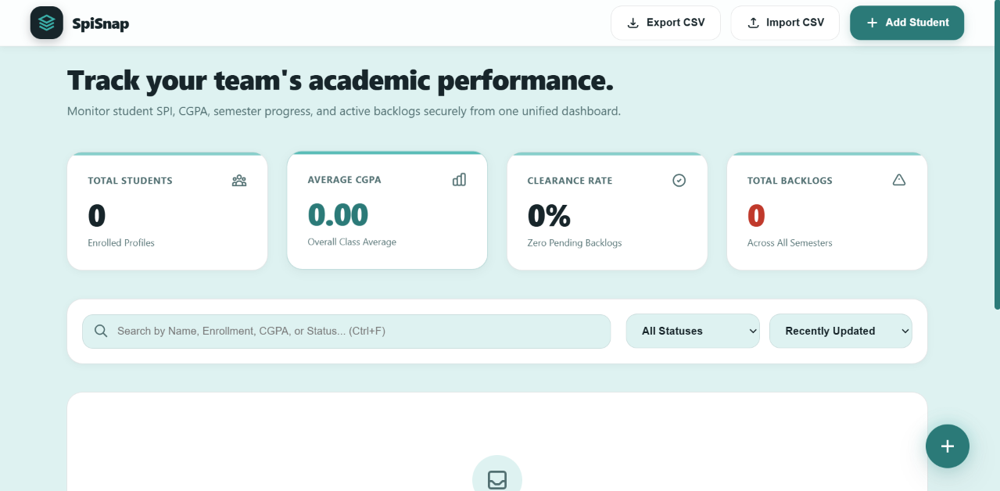
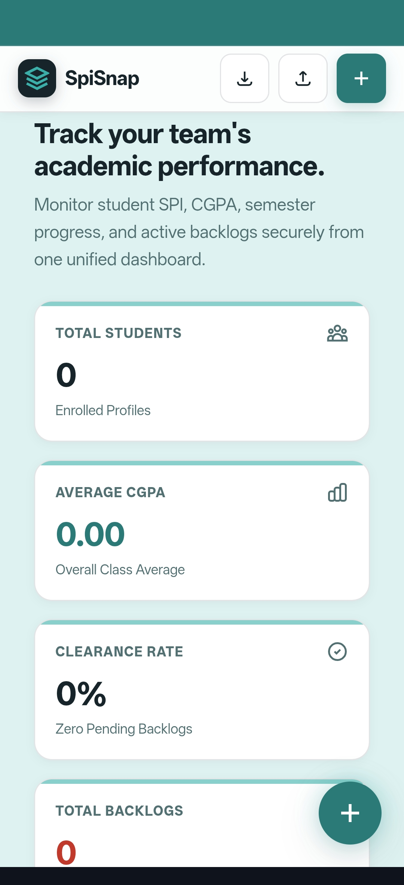

# 🎓 SpiSnap

### Academic Performance Tracker — Built for Smarter Student & Class Performance Management

<div align="center">

<a href="https://sipsnap.netlify.app/" target="_blank">
  
</a>

<a href="https://github.com/Rehan947" target="_blank">
  
</a>

</div>

<div align="center">

**Track • Analyze • Manage • Improve**

A modern academic performance tracking experience designed to make
student SPI, CGPA, semester progress, and backlog monitoring simple.

</div>

---

# 🌐 Live Application

<div align="center">

### 🚀 Experience SpiSnap Live

<a href="https://sipsnap.netlify.app/" target="_blank">
  
</a>

<br><br>

**Live Demo:**  
https://sipsnap.netlify.app/

</div>

---

# 📸 Product Preview

## 🖥️ Dashboard

The SpiSnap dashboard provides a centralized view of academic performance,
allowing users to monitor student records, CGPA, clearance rate, and
overall backlog information from one interface.

<p align="center">
  
</p>

---

## 📱 Mobile Responsive Experience

SpiSnap is designed to provide a responsive experience across different
screen sizes, making academic performance information accessible on
desktop, tablet, and mobile devices.

<p align="center">
  
</p>

---

# 🎯 About SpiSnap

**SpiSnap** is an academic performance tracking application designed to
simplify the management and monitoring of student academic records.

The platform brings important academic indicators into one unified
dashboard, including:

- Student records
- SPI
- CGPA
- Semester progress
- Backlogs
- Academic status
- Class-level performance indicators

The goal is simple:

> **Make academic performance tracking easier, faster, and more organized.**

---

# 📊 Dashboard Overview

SpiSnap provides a centralized academic dashboard with key performance
indicators.

### Dashboard Metrics

- 👨‍🎓 **Total Students**
- 📈 **Average CGPA**
- ✅ **Clearance Rate**
- ⚠️ **Total Backlogs**

These metrics provide a quick overview of overall academic performance.

---

# 👨‍🎓 Student Management

SpiSnap allows student academic records to be added and managed through
a structured student record interface.

### Student Information

- Enrollment Number
- Student Name
- Semester-wise SPI
- Semester-wise Backlogs
- Academic Status
- Current CGPA

The application also supports automatic CGPA calculation when the current
CGPA field is left blank.

---

# 📚 Semester Performance Tracking

Academic performance can be organized semester by semester.

### Supported Semester Data


Semester 1
   ↓
SPI + Backlogs + Status

Semester 2
   ↓
SPI + Backlogs + Status

Semester 3
   ↓
SPI + Backlogs + Status

Semester 4
   ↓
SPI + Backlogs + Status

This structure makes it easier to understand a student's academic journey
across multiple semesters.

🔎 Search & Filtering

SpiSnap provides a searchable student management experience.

Users can search student records using information such as:

Student Name
Enrollment Number
CGPA
Academic Status

This makes it easier to locate and review specific student records.

📁 Data Import & Export

SpiSnap includes data management functionality for working with student
records.

Available Actions
📤 Export CSV
📥 Import CSV
➕ Add Student

CSV support makes it easier to work with structured academic records and
move data between different workflows.

⚡ Key Features
Feature	Description
👨‍🎓 Student Records	Manage academic student profiles
📊 Dashboard	Centralized academic performance overview
📈 SPI Tracking	Monitor semester-wise SPI
🎓 CGPA Tracking	Track overall academic performance
📚 Semester Progress	Organize academic performance by semester
⚠️ Backlog Tracking	Monitor pending academic backlogs
🔎 Search	Quickly find student records
📁 CSV Import	Import structured student data
📤 CSV Export	Export student records
📱 Responsive UI	Designed for multiple screen sizes
⚡ PWA	Progressive Web App experience
🔍 SEO	Search-engine-friendly implementation
🛠️ Technology Stack
<div align="center"> <a href="https://developer.mozilla.org/en-US/docs/Web/HTML" target="_blank">  </a> <a href="https://developer.mozilla.org/en-US/docs/Web/CSS" target="_blank">  </a> <a href="https://developer.mozilla.org/en-US/docs/Web/JavaScript" target="_blank">  </a> <a href="https://developer.mozilla.org/en-US/docs/Web/Progressive_web_apps" target="_blank">  </a> </div>
Frontend
HTML5 — Semantic application structure
CSS3 — Styling, layout and responsive behavior
JavaScript — Application interactions and functionality
PWA — Progressive Web App experience
Engineering Focus
Responsive web development
Component-oriented interface thinking
Structured data handling
User-focused dashboard design
Performance-conscious frontend development
SEO-conscious implementation
📱 Responsive Design

SpiSnap was designed with responsive behavior in mind so the application
can adapt to different viewport sizes.

Target Experiences
Desktop
   ↓
Tablet
   ↓
Mobile

The interface focuses on maintaining usability and accessibility of
important academic information across screen sizes.

📲 Progressive Web App

SpiSnap is built with a Progressive Web App (PWA) approach.

The PWA implementation is intended to provide a more app-like experience
while keeping the project accessible through the web.

PWA Focus
📱 App-like web experience
⚡ Fast access
🧩 Installable web experience
🌐 Web-first accessibility
📲 Mobile-friendly interaction
🔍 SEO Optimization

SEO was also considered as part of the project implementation.

SEO Focus
🔎 Search-engine-friendly structure
🏷️ Meaningful page metadata
📄 Semantic HTML structure
🌐 Crawl-friendly content
📱 Mobile-friendly experience
⚡ Performance-conscious implementation

The goal was to build SpiSnap not only as a functional web application,
but also as a properly structured and discoverable web product.

🎨 UI / UX Focus

Special attention was given to creating a clean academic management
experience.

Design Principles
🧩 Clear dashboard composition
👁️ Strong information hierarchy
📊 Easy-to-scan performance metrics
📖 Readable academic information
📱 Responsive layouts
🧭 Simple navigation and interactions
⚡ Fast access to important information
🎯 User-focused workflows
🏗️ Development Approach

The project was developed with a product-oriented frontend approach.

Development Flow
Problem Identification
        ↓
Product Planning
        ↓
UI / UX Structure
        ↓
Dashboard Design
        ↓
Student Data Workflow
        ↓
Responsive Implementation
        ↓
PWA Optimization
        ↓
SEO Optimization
        ↓
Testing & Refinement
        ↓
Deployment
💡 What This Project Demonstrates

SpiSnap demonstrates practical frontend development skills including:

Building a complete dashboard-based web application
Designing information-heavy interfaces
Creating responsive user experiences
Managing structured student information
Implementing search and filtering workflows
Working with CSV-based data workflows
Building PWA-oriented experiences
Applying SEO-conscious development practices
Creating mobile-responsive interfaces
Deploying a live web application
Thinking beyond UI toward complete product experience
🔐 Project & Source Code

The live SpiSnap application is available for public evaluation through
the demo link above.

The source code is intentionally kept private to protect the complete
implementation while still allowing the finished product, UI/UX,
responsive experience, and engineering approach to be evaluated.

👨‍💻 Developer
<div align="center">
Rehan

Front-End Developer • Data Analytics & Data Science Enthusiast

</div>

I am a developer with hands-on experience building responsive and
production-oriented web interfaces.

My frontend experience includes developing responsive web applications
using HTML, CSS, and JavaScript with a strong focus on usability,
maintainability, and real-world product requirements.

💼 Professional Experience
Front-End Developer — Narjis Infotech

📍 Ahmedabad, Gujarat
📅 January 2025 — March 2026

Key Experience
Building responsive web interfaces
Developing mobile-first layouts
Working with HTML, CSS, and JavaScript
Cross-browser interface development
Maintaining clean and structured frontend code
Delivering 9+ production web projects
Working independently on complete frontend implementations
🌐 Connect With Me
<div align="center"> <a href="https://github.com/Rehan947" target="_blank">  </a> <a href="https://www.linkedin.com/in/rehan-pathan-" target="_blank">  </a> <a href="https://rehan-rk.netlify.app/" target="_blank">  </a> </div>
🔮 Future Improvements

Potential future improvements for SpiSnap include:

 Advanced analytics dashboard
 Performance charts
 More semester support
 Student performance trends
 Advanced filtering
 Authentication system
 Cloud data persistence
 Role-based access
 Institution / class management
 Advanced reporting
 Enhanced accessibility
📌 Project Status
<div align="center">     </div>

SpiSnap is currently available as a live deployed web application.

🏆 Project Highlights
🎓 Academic Tracking	📊 Dashboard	📱 Responsive	⚡ PWA	🔍 SEO
SPI / CGPA	Performance Metrics	Multi-device	Web App	Optimized
🚀 Explore SpiSnap
<div align="center">
Ready to explore the academic performance tracker?
<br> <a href="https://sipsnap.netlify.app/" target="_blank">  </a>

<br><br>

Track • Analyze • Improve

<br><br>

Designed & Developed by Rehan

</div>
<div align="center">
🎓 SpiSnap

Academic Performance Tracking Made Simple

<br>

⭐ Explore more of my work through my portfolio and GitHub profile.

</div> ```


